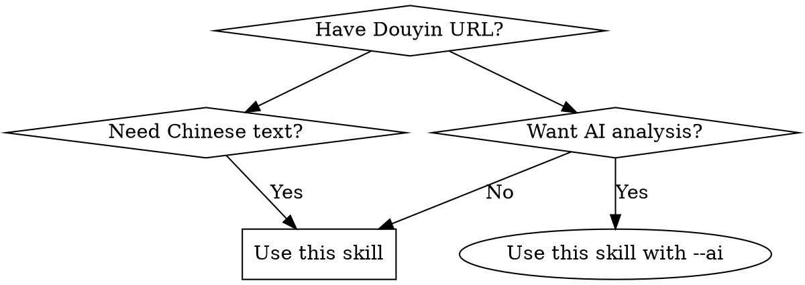

# Douyin Video Transcription

## Overview

Transcribe Douyin (TikTok China) videos to text using Whisper with GPU acceleration. Automatically downloads videos, extracts audio, transcribes with Chinese-optimized models, and generates structured Markdown reports. Optional AI analysis for intelligent content summarization.

## When to Use



**Triggers:** `douyin.com` URL, keywords (抖音转录、抖音视频转文字、提取抖音字幕、transcribe douyin), request for Douyin subtitles/speech extraction.

**When NOT to use:** Non-Douyin platforms, English-only content, real-time requirements.

## Quick Reference

| Command | Mode | Use When |
|---------|------|----------|
| `node douyin_transcribe.js` | Interactive | User wants to paste URL(s) manually |
| `node douyin_transcribe.js "URL"` | Single URL | URL provided directly |
| `node douyin_transcribe.js --batch "url1,url2"` | Batch | Multiple URLs at once |
| `node douyin_transcribe.js --ai "URL"` | AI Analysis | Generate intelligent report with LLM |

**Supported URL formats:**
- `https://www.douyin.com/video/{video_id}`
- `https://www.douyin.com/user/{user_id}?modal_id={video_id}`
- `https://www.douyin.com/jingxuan?modal_id={video_id}`

## Output

**Location**: `~/.longerian/data/douyin/`

| File | Content |
|------|---------|
| `douyin_{timestamp}-报告.md` | Structured report (AI or rule-based) |
| `douyin_{timestamp}-transcript.txt` | Plain text |
| `douyin_{timestamp}-segments.txt` | Timestamped segments |
| `douyin_{timestamp}.mp4` | Downloaded video |

**Report structure (AI mode)**: summary, outline, core points, key entities, detailed sections (AI-generated), keywords.

**Report structure (rule mode)**: summary, outline, core points, key entities, detailed sections (time-based), keywords.

## Prerequisites

**Required:**
- Python 3.12+ (for PyTorch CUDA support - 3.14 lacks CUDA builds)
- NVIDIA GPU with CUDA drivers
- Node.js with `playwright`
- `ffmpeg` for audio processing

**For AI Analysis (optional):**
- `openai` Python package: `pip install openai`
- API Key: Set `ZHIPU_API_KEY` or `OPENAI_API_KEY` environment variable

**Verify GPU:**
```bash
python -c "import torch; print(torch.cuda.is_available())"  # Should be True
python -c "import torch; print(torch.cuda.get_device_name(0))"  # Your GPU name
```

**Install:**
```bash
# Python 3.12 (CUDA)
pip install openai-whisper torch torchvision torchaudio --index-url https://download.pytorch.org/whl/cu121
# For AI analysis
pip install openai
# Node.js
npm install playwright && npx playwright install
# ffmpeg
choco install ffmpeg
```

## Performance

RTX 4070 SUPER: 2.5 min video → ~6 seconds (~25x real-time). CPU would take ~112 seconds.

## Features

**v2.1**: AI-powered report generation with --ai flag (requires API key). Generates intelligent summaries, content outlines, and structured sections.

**v2.0**: Enhanced punctuation, keyword extraction, batch processing. See IMPLEMENTATION.md for details.

## Common Mistakes

| Mistake | Symptom | Fix |
|---------|---------|-----|
| Wrong Python version | CUDA not available errors | Use Python 3.12, not 3.14 |
| Expired video URL | "Video URL not found" | Fetch fresh URL (Douyin signatures expire) |
| Missing ffmpeg | Audio extraction fails | Install ffmpeg via choco/brew |
| Poor transcription quality | Garbled text | Check original audio quality, background noise affects accuracy |

## Known Limitations

- Douyin video URLs expire quickly - must fetch fresh each time
- Punctuation is heuristic-based, not 100% accurate
- Background music/noise affects transcription accuracy
- Name recognition may need manual correction (e.g., 老川→老船, 检藏→减仓)
- Batch processing is sequential, not parallel (to avoid overwhelming network/GPU)
- Requires NVIDIA GPU - CPU fallback is much slower

## Implementation

See `IMPLEMENTATION.md` for detailed pipeline steps, code examples, and troubleshooting.
